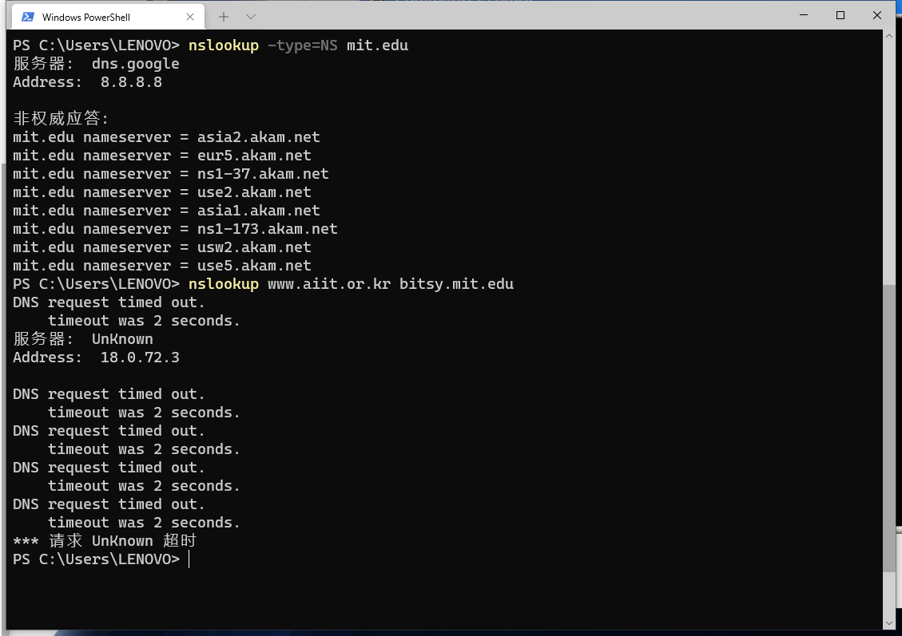
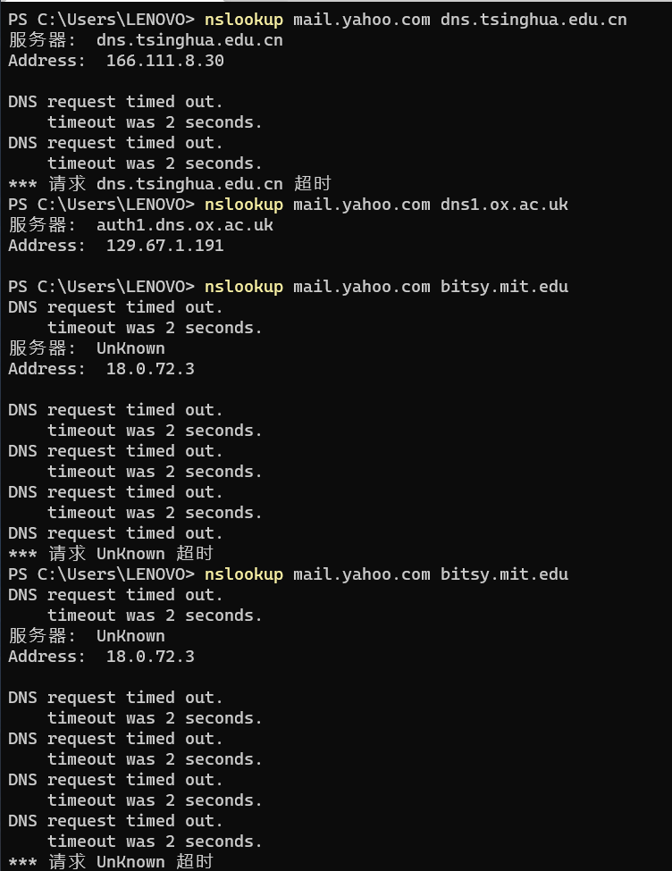
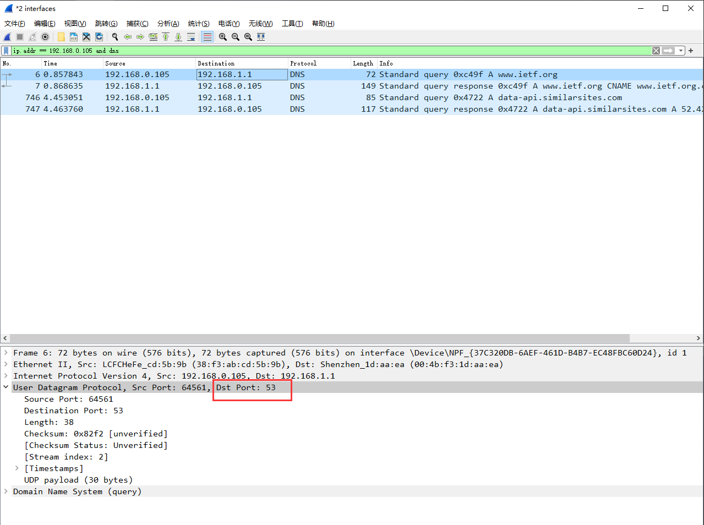

## nslookup

### 引入

在本实验中，我们将广泛使用 nslookup 工具，该工具现在在大多数 Linux / Unix 和 Microsoft 平台上都可用。 要在 Linux / Unix 中运行 nslookup，只需在命令行上键入 nslookup 命令即可。 要在 Windows 中运行它，请打开命令提示符并在命令行上运 行 nslookup。

在最基本的操作中，nslookup 工具允许运行该工具的主机向任何指定的 DNS 服务 器查询 DNS 记录。 查询的 DNS 服务器可以是根 DNS 服务器，顶级域 DNS 服务 器，权威 DNS 服务器或中间 DNS 服务器（有关这些术语的定义，请参阅教科 书）。 要完成此任务，nslookup 会将 DNS 查询发送到指定的 DNS 服务器，从同 一 DNS 服务器接收 DNS 回复，并显示结果。

语法：

```
nslookup –option1 –option2 host-to-find dns-server 
```

一般来说，nslookup 可以不添加选项，或者添加一两个甚至更多选项。正如我们 在上面的示例中看到的，dns-server 也是可选的；如果这项没有提供，查询将发送 到默认的本地 DNS 服务器。





### 实验

[阮一峰的DNS原理入门](http://www.ruanyifeng.com/blog/2016/06/dns.html)

首先清理DNS缓存：


1. 运行 nslookup 以获取一个亚洲的 Web 服务器的 IP 地址。该服务器的 IP 地址 是什么？

   ANS:我使用的Google DNS 8.8.8.8 替代我的 ISP 服务商的 DNS 进行查 询，这里我查询的是清华大学（http://www.tsinghua.edu.cn）的 IP 地址，可以在图中看到我请求Google DNS 来获取清华大学的 IP 地址。 清华大学分别有 IPV4 地址（166.111.4.100）和 IPV6 地址 （2402:f000:1:404:166:111:4:100）

   

   因为我使用的是Google DNS，Google DNS 非 清华大学实际域名配置管理 DNS，没有缓存情况下，他也不知道清华大学的 IP 地址，于是他只能向根 DNS，LTD 顶级域名 DNS，次级域名 DNS 迭代查询 并且返回。

   使用-type=NS 选项，根据书面解释说 NS：域名服务器记录（Name Server）， 返回保存下一级域名信息的服务器地址，这句话不太好理解。我自己理解是 如果我要查询的清华大学 IP 的话，在最后一级 DNS 查询的应该是清华大学 的权威 DNS，这个 DNS 上有清华大学域名和 IP 信息，我们查询到这个权威 DNS 之后然后就可以得到清华大学域名所对应的 IP 了，而这个选项就是为了 查询权威 DNS 用的。

   

   为什么还叫非权威应答？因为查询这些权威 DNS 也是一步步迭代查询的，并 且是可能缓存的，如果我们直接向权威 DNS 查询，就不会遇到此情况。

   

   个人理解所谓非权威就是意思就是来源是一步步查询，并不是直接查询。 权威服务器 DNS 是保存着这个域名 IP 等信息的一个最终 DNS 名称，也是查 询的最后一级

   另外我还发现通过 NS 查询一级域名（不含 www）和二级域名（含 www） 的结果不一样，这点我无法直接解释。

   

   可能 NS 查询必须要通过一级域名查询，我无法解释这个二级域名查询结果。


2. 运行 nslookup 来确定一个欧洲的大学的权威 DNS 服务器

   这里直接 NS 查询一级域名，我查了是牛津大学的

   	

   

3. 运行 nslookup，使用问题 2 中一个已获得的 DNS 服务器，来查询 Yahoo!邮箱 的邮件服务器。它的 IP 地址是什么？

   ANS:直接通过上述权威服务器查不到，但是可以递归 or 迭代查到。

   

   

4. 找到 DNS 查询和响应消息。它们是否通过 UDP 或 TCP 发送？

   

## ipconfig

### 引入

ipconfig（对于 Windows）和 ifconfig（对于 Linux / Unix）是主机中最实用的程 序，尤其是用于调试网络问题时。这里我们只讨论 ipconfig，尽管 Linux / Unix 的 ifconfig 与其非常相似。 ipconfig 可用于显示您当前的 TCP/IP 信息，包括您的地 址，DNS 服务器地址，适配器类型等。例如，您只需进入命令提示符，输入

```
 ipconfig /all
```

所有关于您的主机信息都类似如下面的屏幕截图所显示。

朗读 ipconfig 对于管理存储在主机中的 DNS 信息也非常有用。在 2.5 节中，我们了 解到主机可以缓存最近获得的 DNS 记录。要查看这些缓存的记录，请在提示符 C：\>之后提供以下命令：

```
ipconfig /displaydns
```

每个条目显示剩余的生存时间（TTL）（秒）。要清除缓存，请输入

```
ipconfig /flushdns 
```

清除了所有条目并从 hosts 文件重新加载条目。


### 实验

4. 找到 DNS 查询和响应消息。它们是否通过 UDP 或 TCP 发送？

   

   UDP发送

5. DNS 查询消息的目标端口是什么？ DNS 响应消息的源端口是什么

   查询的目标端口和相应端口都是 53

   

   


6. DNS 查询消息发送到哪个 IP 地址？使用 ipconfig 来确定本地 DNS 服务器的 IP 地址。这 两个 IP 地址是否相同

   发送到是我电脑本地 DNS 服务器的 IP 地址，这两个ip地址相同。

   

   

7.  检查 DNS 查询消息。DNS 查询是什么"Type"的？查询消息是否包含任何"answers"？

   TYPE=A，意思查询请求的 IP 地址，查询消息不包括任何的结果。

   

8. 检查 DNS 响应消息。提供了多少个"answers"？这些答案具体包含什么

   

   提供了 3 个答案，分别是由国外 CDN 厂商 Cloudflare 提供的规范 CNAME 的 CDN 加 速（type=cname）地址，以及规范后 CNAME 的两个 IPV4 地址（type=a）。


注：第9个问题开始没有做了，太多了

